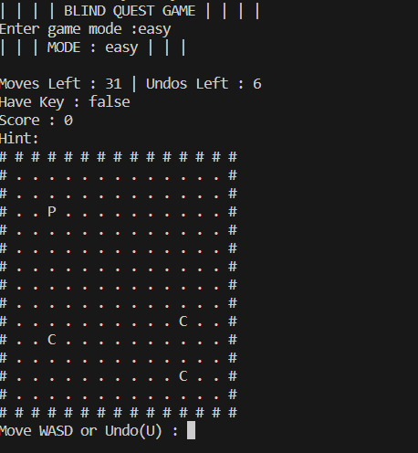
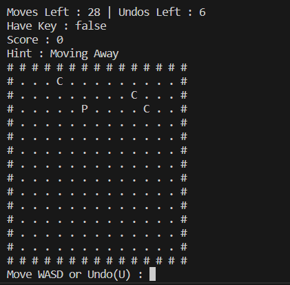
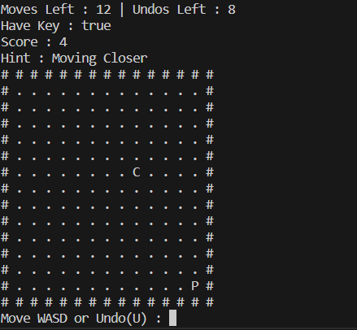
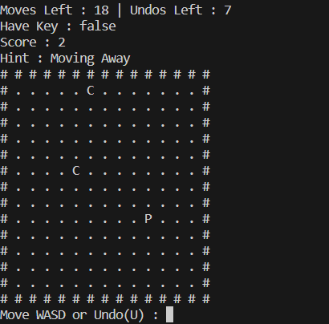
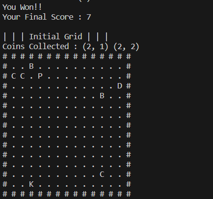
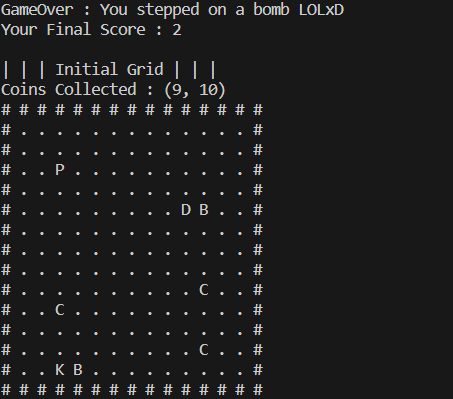

# Blind Quest Game

## Introduction
You are lost in a dangerous dark place and you have to escape alive. But the exit is locked find a key to excape. But be careful there are some bombs hidden in dark. Don't run for the shining coins.

## Key Features
- 3 Game Modes i.e. 🎂EASY(6 Extra Moves + 6 Undos), 🕊️MEDIUM(2 Extra Moves + 4 Undos) and ☠️HARD(Fixed Moves + No Undos)
- Sensing Ability that tells you whether you are going in right direction
- Bombs in your way to make game more challenging
- Initial game state and coins collected are displayed at last
- Use PDCurses for seamless display

## How to Run the Game
### Prerequisites
- A C++ compiler (e.g., g++, clang++)
- PDCurses Library
- Terminal (Windows Only)
- Visual Studio Code (Windows Only)
- Visual Studio Community (Windows Only)

### Instructions
1. **Download and setup a C++ compiler using MINGW**
   - Refer to this site to setup MINGW : https://ghost-together.medium.com/how-to-install-mingw-gcc-g-compiler-on-windows-f7c805747a00

2. **Setup PDCurses**
   - Download and install PDCurses 3.9 on your system.
    
3. **Clone Repository**
   - Using Github Desktop(Windows):
     1. Open Github Desktop
     2. Click on File in left top corner
     3. Select URL and paste the URL : https://github.com/BalaajRaza/Blind-Quest-Game
     4. Click Clone
        
    - Using Git : write this command in terminal 
      ```bash
       git clone https://github.com/BalaajRaza/Blind-Quest-Game.git
       cd Blind-Quest-Game
      ```
4. **Open the Project in Your Preferred IDE**
   - Open Visual Studio Code or Visual Studio Community
   - Open the folder containing the cloned repository

5. **Build and Run the Game**
   - **Using Terminal**
     1. Go in to your repository folder
     2. Right click and open a new terminal
     3. Run the game using g++
         ```bash
        g++ grid.cpp coins.cpp player.cpp game.cpp -o game
        ```
     4. Run the executable:
        ```bash
        ./game
        ```
        
   - **Using Visual Studio Code:**
     1. Open your repository folder in VS Code
     2. Open a new terminal (make sure the terminal is in your repo directory)
     3. Compile the game using g++:
        ```bash
        g++ grid.cpp coins.cpp player.cpp game.cpp -o game
        ```
     4. Run the executable:
        ```bash
        ./game
        ```

   - **Using Visual Studio Community**
       1. Create a new empty C++ projecy
       2. Copy the game files from the cloned repo
       3. In VS Community look for SourceFiles in Solution Explorer
       4. Add the copied files in SourceFiles folder
       5. Now just build and run the game

## Gameplay 
### Rules
  1. Player can move in four directions within the boundries of game. You can't move back to the previous cell
  2. Player need to collect a key and exit through the door to win the game
  3. You will lose if you step on a bomb or run out of moves
  4. Player is given a fixed number of moves that depend on distance from key and door. Extra moves are given according to difficulty level
  5. Undos are given according to difficulty level. Undo allow you to move back to previous cell
  6. You can collect coins to increase your score and get an extra undo. Coins change positions after 10s
  7.  Trying to move through boundries or moving into door without key are invalid moves and won't consume your moves

### Game in Action
1. **Game Start**
   


2. **Hints**
   


3. **Key Status**
   


4. **Coins Change Positions**
   


5. **Game Win**
   


6. **Game Lose**
   


## Libraries
 - curses.h(PDCurses) is used in this to display the game seamlessly.
 - chrono and thread have been used to calculate time and change positions of coins
 - Other common libraries used : string, ctime, cstdlib and utility

## Contributions
This small project was made as an university assignments and was meant to be completed under a given deadline. So this may lack alot of things. Feel free to fork this repo and contribute to the project. Any pull request for improvements or bug fixes are happily welcomed.

